# 🎟️ Meeting Raffle

Fair, fun and auditable prize draws, plus attendance insights, for meetings and events. Upload the
attendance reports of your Microsoft Teams meetings (any language or version), Zoom/Google Meet/Webex
exports, spreadsheets or just paste a list of names. Set a few rules, reveal the winners with a show made
for large audiences (wheel, race, spotlight, last one standing, lottery or name shuffle), and measure how
your event series is doing: audience, retention, loyalty, engagement and prizes.

**Demo here:** https://meeting-raffle.streamlit.app/

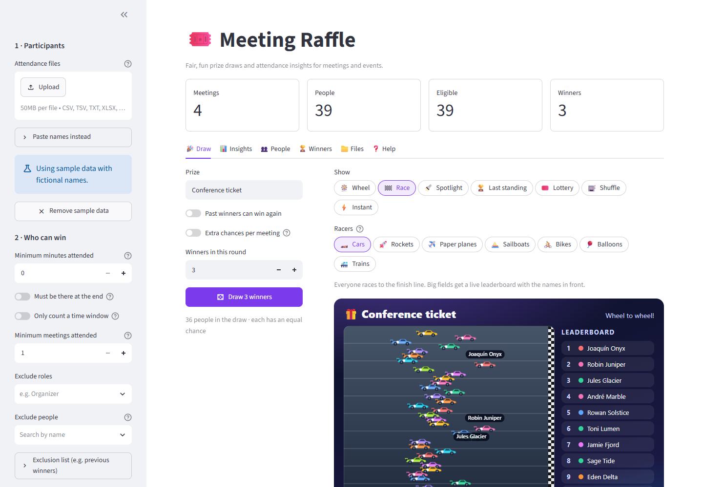

## Highlights

- **Works with the files you already have.** Current and classic Teams attendance reports in any
  language, Zoom, Google Meet and Webex exports, CSV/TSV/TXT/Excel lists. Encodings (UTF-16, UTF-8,
  Windows-1252), separators and date formats are detected automatically.
- **Several meetings at once.** Combine a whole event series; the same person is recognized across
  files even when their name is written differently.
- **Clear eligibility rules.** Minimum minutes, staying until the end, a time window, a minimum number
  of meetings, and exclusions by role, by person or by a list (such as past winners). Every person shows
  why they are or aren't eligible.
- **A show for the whole audience.** 🎡 Wheel, 🏁 race (cars, rockets, paper planes, sailboats, bikes,
  balloons or trains), 🔦 spotlight, 🏆 last one standing, 🎟️ lottery, 🎰 name shuffle or ⚡ instant
  reveal. Everyone in the draw appears in the show, up to 2,000 people on screen.
- **Fair and auditable.** Winners are picked with a cryptographically secure seed before any animation
  starts. Each round's seed and eligible pool are exported so anyone can reproduce the result.
- **Insights across events.** Audience per event, new vs. returning people, retention over time, minutes
  per person and per event, attendance streaks, engagement (reactions, camera, raised hands, unmutes), a
  configurable relevance score and prizes awarded, including earlier editions.
- **Reports to share.** One Excel file with tables and native charts, optionally anonymized.
- **Privacy by default.** Files are processed in memory, nothing is stored, nobody is pre-excluded, and
  emails stay hidden on screen unless you turn them on.

## Screenshots

| Race with a live leaderboard | Spotlight |
| --- | --- |
| 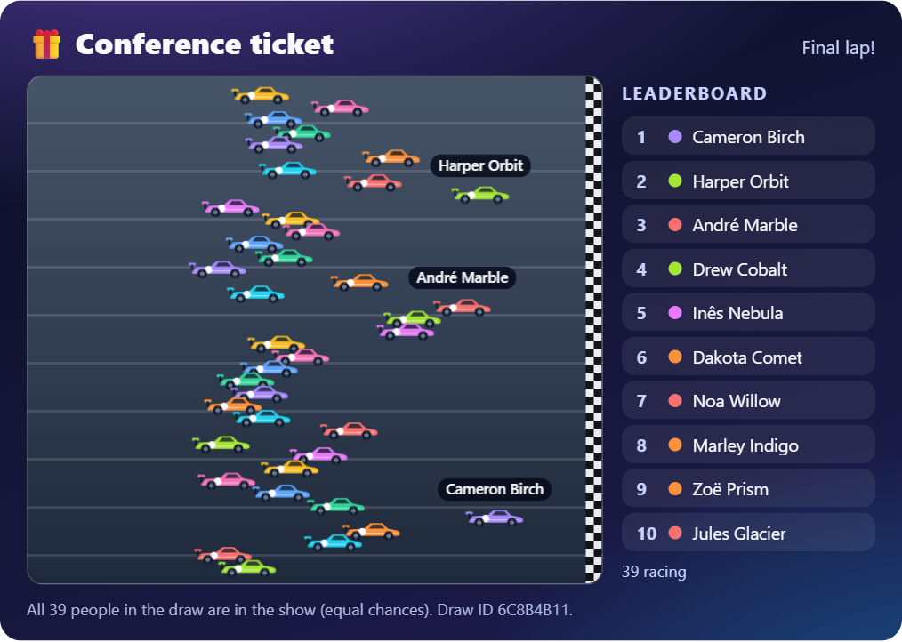 | 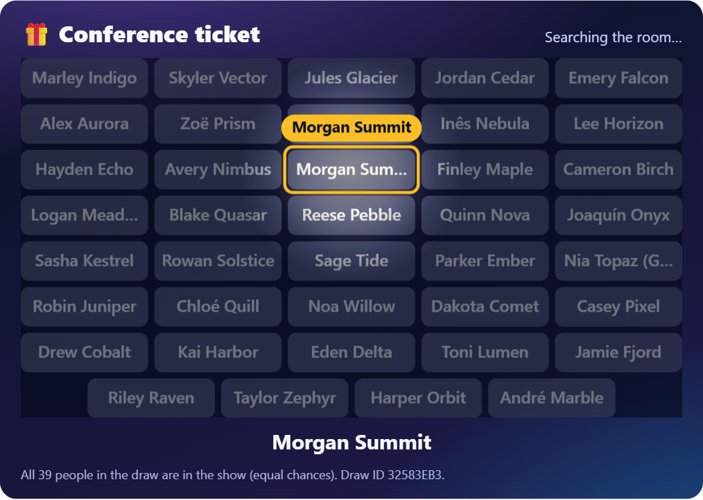 |
| **Last one standing** | **Lottery** |
| 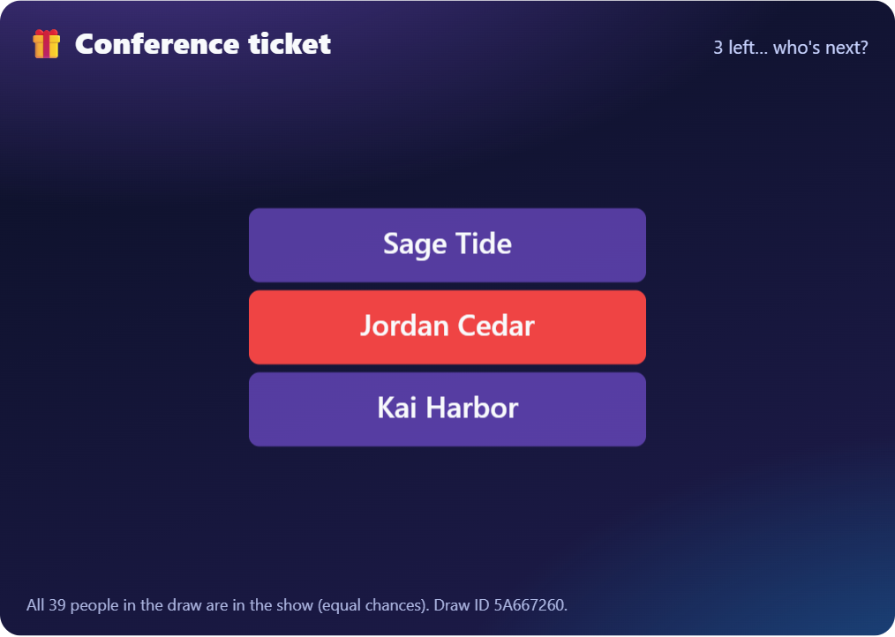 | 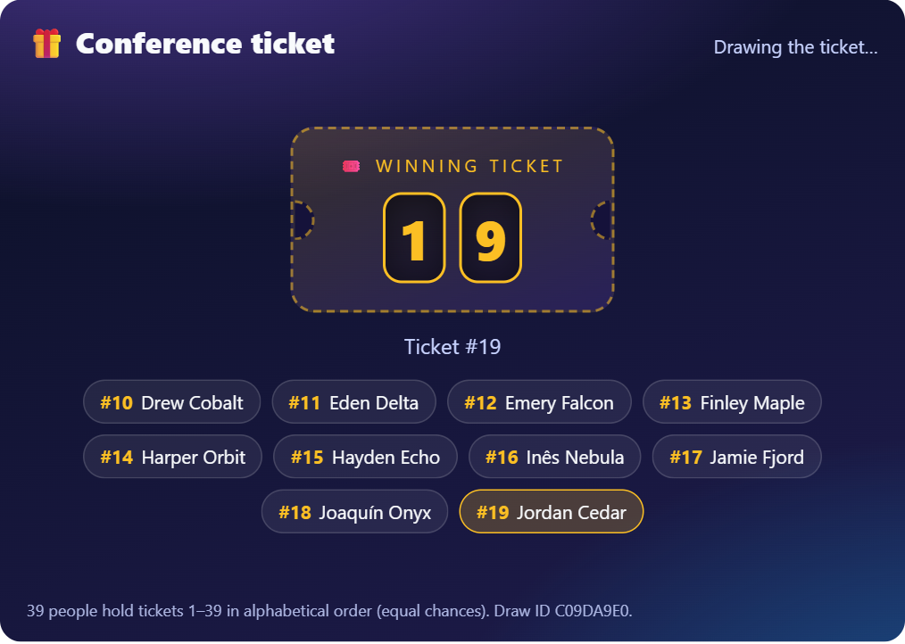 |

| Wheel | Winners |
| --- | --- |
| 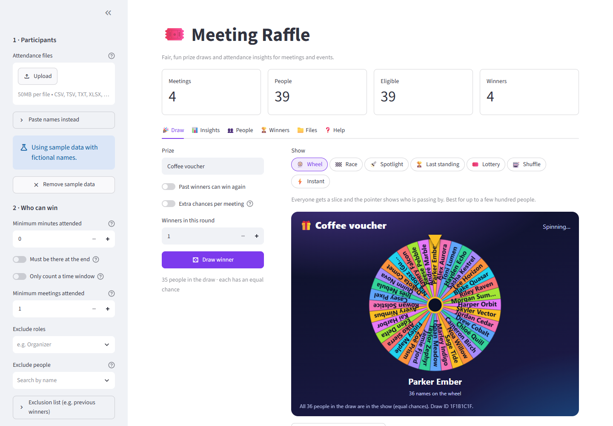 | 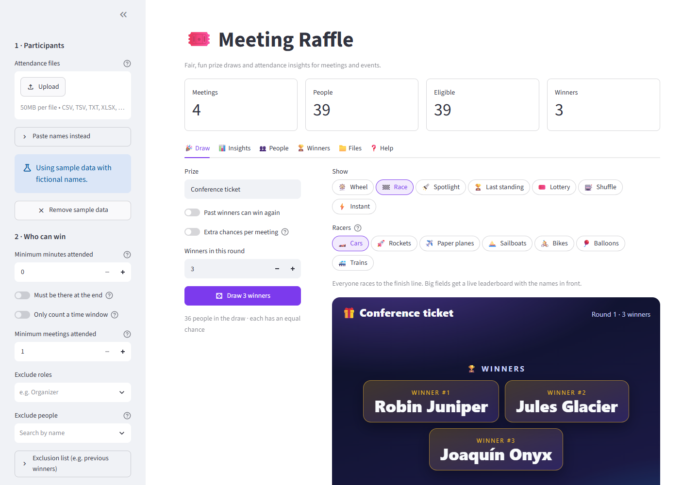 |
| **Who can win, and why** | **Results and audit trail** |
| 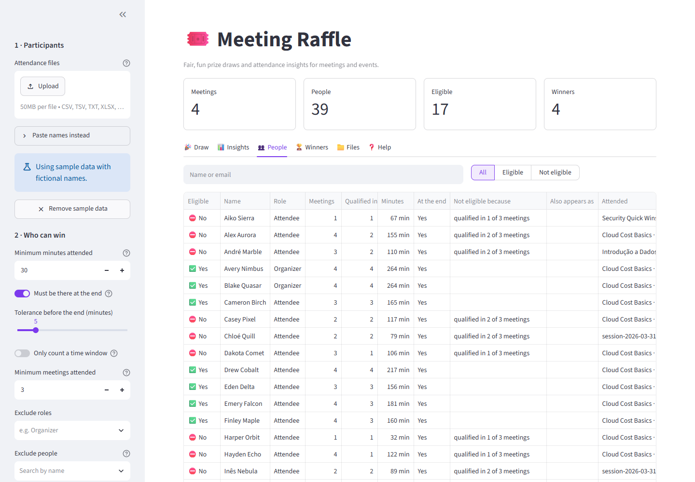 | 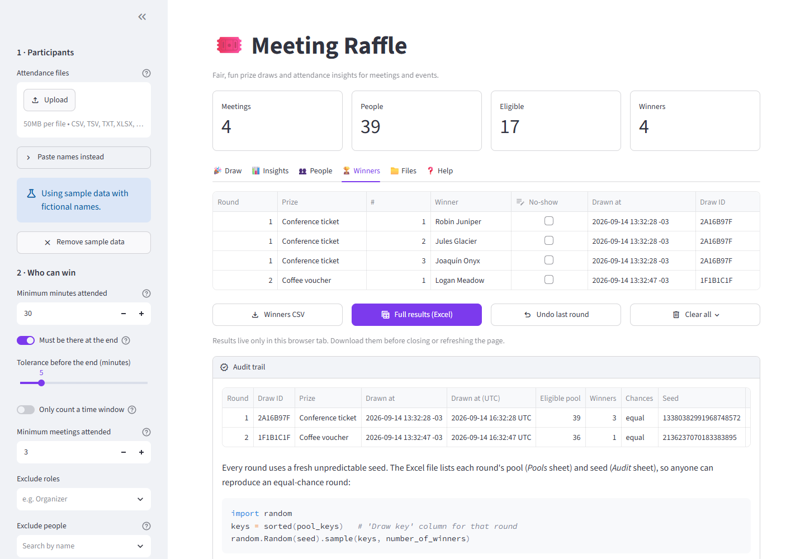 |
| **Insights: overview** | **Insights: audience over time** |
| 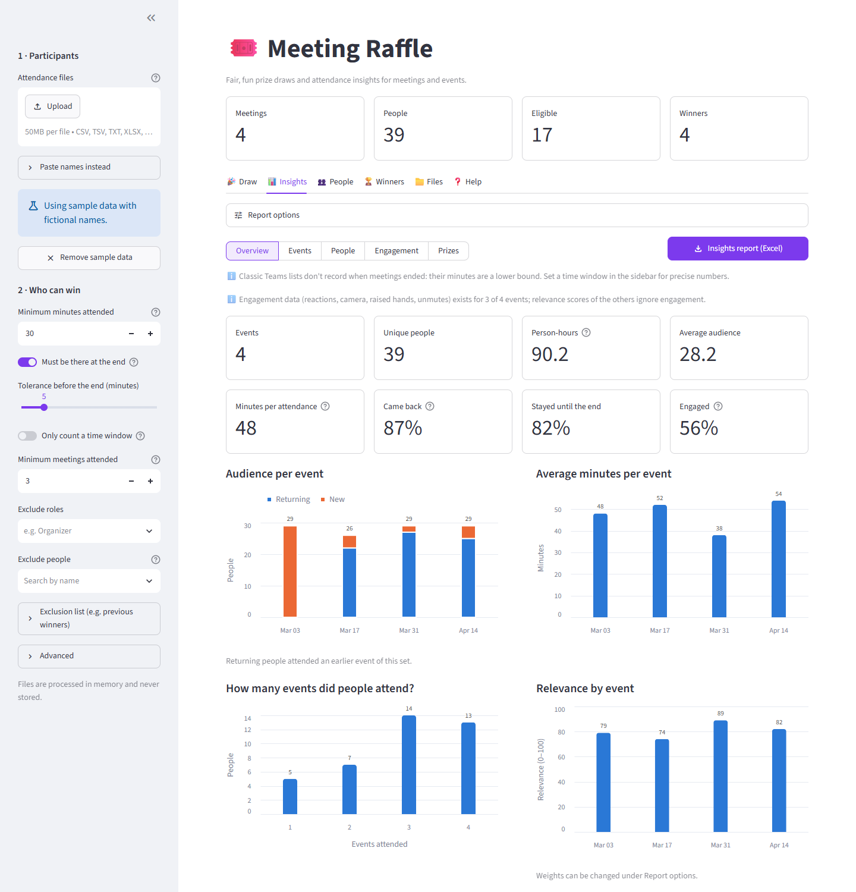 | 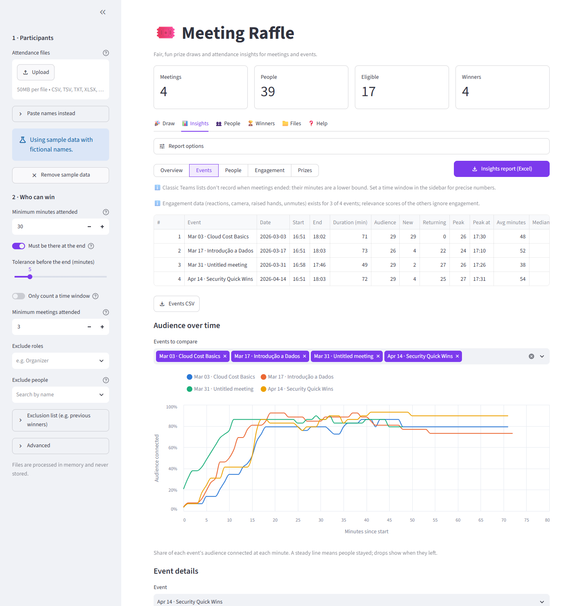 |
| **Insights: participation by person** | **Insights: engagement** |
| 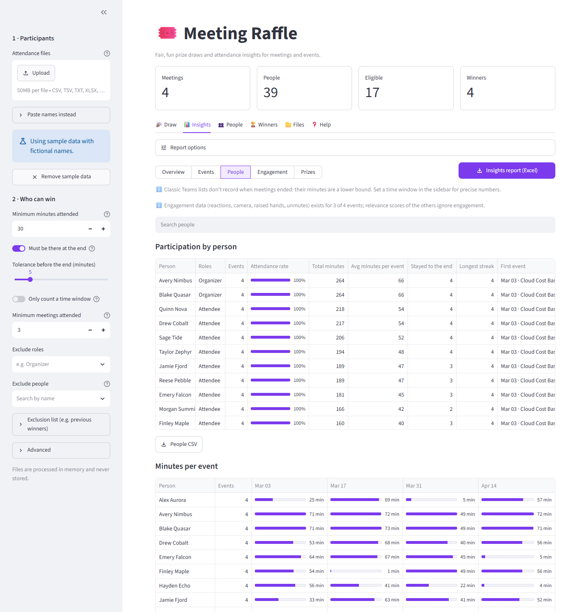 | 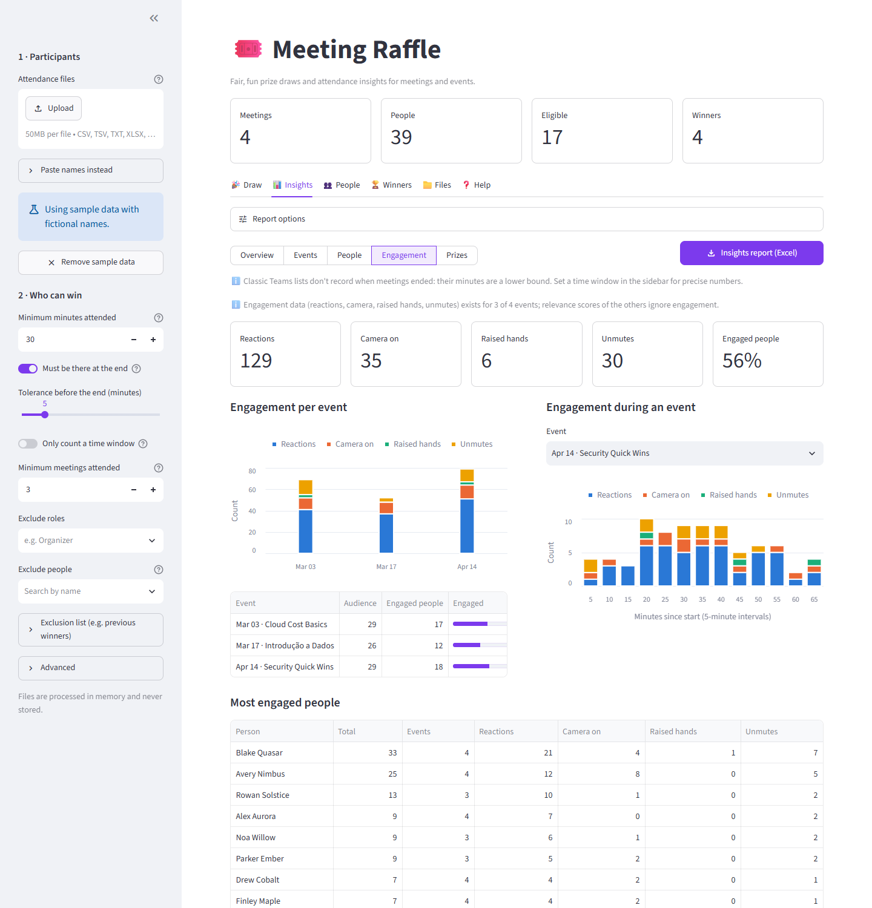 |

All names in the screenshots and sample files are fictional.

## Quick start

Requirements: Python 3.10 or newer.

```bash
python -m venv .venv
```

Activate it with `.venv\Scripts\activate` (Windows) or `source .venv/bin/activate` (macOS/Linux), then:

```bash
pip install -r requirements.txt
```

```bash
streamlit run streamlit_app.py
```

Open the address shown in the terminal and click **Try it with sample data** to explore without your
own files.

### Deploy on Streamlit Community Cloud

1. Fork or push this repository to GitHub.
2. On [share.streamlit.io](https://share.streamlit.io), create an app pointing to `streamlit_app.py`.
3. Pick Python 3.10 or newer in *Advanced settings*. Dependencies are installed from `requirements.txt`.

## How to use it

1. **Load participants** in the sidebar: upload one or more files, or paste names (one per line).
2. **Decide who can win** with the rules below. The *People* tab shows every person, their minutes and
   the reason when they are not eligible.
3. **Draw**: type the prize, choose how many winners and the [show](#shows), then press **Draw**. Repeat
   for each prize. Past winners are left out of the next rounds unless you allow repeats.
4. **Wrap up** in the *Winners* tab: mark no-shows (they leave the draw so you can pick a replacement),
   undo a round, and download the results as CSV or Excel.
5. **Measure** in the *Insights* tab: compare events, see who keeps coming back and download the report.

### Exporting attendance from Microsoft Teams

- **After the meeting**: open the meeting from the Teams calendar or chat → **Attendance** → **Download**.
- **During the meeting**: **People** → **⋯** → **Download attendance list**.

Other tools: Zoom (*Reports → Usage → Participants → Export*), Google Meet attendance reports, Webex
attendance reports, or any spreadsheet with a name column.

## Supported files

| Source | What is read |
| --- | --- |
| Teams attendance report (summary + participants + in-meeting activities + engagement) | title, start/end, every join/leave, email, role, reactions, camera, raised hands, unmutes |
| Teams classic `meetingAttendanceList.csv` (with or without header) | join/leave events per person |
| Zoom, Google Meet, Webex participant exports | name, email, join/leave times or duration |
| Spreadsheets (`.xlsx`, `.xlsm`, `.csv`, `.tsv`) | a *Name* column, or *First name* + *Last name*, optional email/role |
| Plain text (`.txt`) or pasted text | one person per line (numbering and bullets are ignored) |

Headers are recognized in English, Portuguese, Spanish, French, German, Italian and Dutch, and files
without headers are recognized by their content. Roles such as *Organizador* or *Organisateur* are shown
as *Organizer*. A file that contains several meetings far apart in time is split automatically. Old
`.xls` files must be saved as `.xlsx` or `.csv` first.

## Eligibility rules

| Rule | How it works |
| --- | --- |
| Minimum minutes attended | Adds up all connections of a person in a meeting. Overlapping devices count once. |
| Must be there at the end | The last connection must reach the end of the meeting (or of the time window), with a tolerance you choose. |
| Only count a time window | Ignores time before/after the event, e.g. setup or informal chats afterwards. |
| Minimum meetings attended | For event series: a meeting counts only if the person met the other rules in it. |
| Exclude roles / people / list | Nobody is excluded by default. Lists accept names or emails and any supported file, including a winners file from this app. |
| Extra chances per meeting | Optional: each qualifying meeting is one ticket, so regulars have better odds. |

**How people are matched.** The same email is always the same person. Without emails, names are
compared ignoring order, accents, case and markers such as "(Guest)", so *Doe, Jane* and *JANE DOE* count
once. Namesakes with different emails are kept apart. *Merge near-identical names* (Advanced) also joins
typos, but never merges different emails.

**Classic Teams lists** don't record when the meeting ended. People still connected are counted until
the last recorded activity, or until the end of the time window when one is set.

## Shows

Pick how the winners are revealed. The winners are already decided when the show starts; every show just
plays back the same result, so the choice never changes anyone's chances.

| Show | What the audience sees | Best for |
| --- | --- | --- |
| 🎡 Wheel | Everyone gets a slice; the name under the pointer is shown as the wheel spins | up to a few hundred people |
| 🏁 Race | Up to 12 people race in labelled lanes; bigger fields race together with a live leaderboard and name tags on the leaders. Racers: cars, rockets, paper planes, sailboats, bikes, balloons or trains | any size |
| 🔦 Spotlight | Everyone is a tile; a spotlight searches the room and stops on the winner | large audiences |
| 🏆 Last standing | Everyone starts on screen; waves knock people out until only the winners remain, names growing as the field shrinks | large audiences |
| 🎟️ Lottery | Everyone holds a ticket number (alphabetical order); reels reveal the winning number digit by digit, narrowing down the candidates | any size |
| 🎰 Shuffle | Names flash on a big display until one stops | small groups |
| ⚡ Instant | The winners appear right away | many winners at once |

**Large audiences.** Everyone in the draw appears on screen up to 2,000 people (the lottery has no limit).
Above that, the show uses a random sample that always includes the winners and says so on screen. Shows
render on a canvas and were checked at 60 frames per second with 2,000 participants. Rounds with many
winners switch to an instant reveal (for example, more than 5 winners on the wheel).

## Insights and reports

Load several meetings (e.g. every edition of an event series) and open the *Insights* tab. Statistics use
the same identity matching and time window as the draw, but include everyone, not only eligible people.

| View | What it shows |
| --- | --- |
| Overview | events, unique people, person-hours, average audience, minutes per attendance, share of people who came back, stayed until the end and engaged; charts of audience (new vs. returning), average minutes, events attended per person and relevance |
| Events | one row per event: duration, audience, new/returning, peak and when it happened, average and median minutes, average share attended, stayed to the end, engagement and relevance; audience over time (retention curves) and per-event details |
| People | events attended, attendance rate, total and average minutes, times stayed to the end, longest streak of consecutive events, first/last event, engagement, prizes, plus a person × event minutes matrix |
| Engagement | reactions, camera on, raised hands, unmutes (and chat when present) per event, over the course of an event, and the most engaged people |
| Prizes | prizes from this session (no-shows excluded) and from winners files of previous events, repeat winners and how often winners attended compared with everyone |

**Report options**

- **Anonymize people** replaces names with stable codes (*Person 007*) and hides emails on screen and in
  the downloads. Meeting titles are kept as they are.
- **Prize history** accepts winners files from previous events (for example this app's winners CSV). Each
  row is one prize and rows marked as no-show are ignored.
- **Relevance score** is a weighted average of audience (compared with the largest event), retention
  (average share of the event attended) and engagement (share of people who interacted). The weights are
  adjustable; events without engagement data are scored on the remaining components.

**Downloads.** *Insights report (Excel)* contains the sheets Overview, Events, People, Minutes per event,
Audience over time, Engagement, Prizes and Files, with native Excel charts. Each table is also available
as CSV.

**Good to know.** Engagement columns are read from Teams attendance reports when present; their labels
are recognized in several languages on a best-effort basis. Classic Teams lists have no end time, so their
minutes are a lower bound unless a time window is set. Plain lists count for audience but not for minutes.

## Fairness and audit

Each round draws a fresh 64-bit seed from the operating system's secure random generator and picks the
winners from the eligible pool sorted by a stable *Draw key*. The animation only plays back that result.

The Excel download contains the winners, the pool of every round (*Pools* sheet) and each round's seed
and pool SHA-256 fingerprint (*Audit* sheet). An equal-chance round can be reproduced with:

```python
import random

keys = sorted(pool_keys)  # "Draw key" column of that round
random.Random(seed).sample(keys, number_of_winners)
```

## Privacy

- Uploaded files are processed in memory for your browser session and are never written to disk.
- Results live in the session only: download them before closing or refreshing the page.
- No names are bundled with the app and no one is excluded by default.
- Emails are hidden on screen unless *Show emails on screen* is enabled; draw downloads always include them.
- Insights can be anonymized on screen and in the Excel report before sharing them.
- Exported CSV/Excel files neutralize spreadsheet formulas coming from uploaded data.
- Usage statistics collection by Streamlit is disabled in `.streamlit/config.toml`.

When deployed on a hosted service (such as Streamlit Community Cloud), uploaded files are processed on
that server.

## Project structure

```text
streamlit_app.py         Streamlit user interface
raffle/
  loader.py              reads files: encodings, separators, Excel, plain lists
  formats.py             recognizes tables, headers and actions in many languages
  timeparse.py           dates, times and durations in regional formats
  names.py, text.py      name formatting and identity keys
  people.py              merges people across meetings and applies the rules
  draw.py                secure, reproducible draws
  stage.py, stage.html   animated reveal (wheel, race, shuffle)
  insights.py            audience, retention, loyalty, engagement and prize statistics
  charts.py              insight charts (color-vision-safe palette, light and dark)
  reports.py             insight tables and the Excel report
  export.py              CSV/Excel exports with audit data
  samples.py             generator of the fictional sample files
examples/                sample files (fictional names)
tests/                   automated tests
```

## Development

```bash
pip install -r requirements-dev.txt
```

```bash
pytest
```

The sample files in `examples/` are generated with `python -m raffle.samples`.

## Troubleshooting

- **A file is not recognized**: check the *Files* tab for the reason. Saving the report again as `.csv`
  or `.xlsx`, or pasting the names, always works.
- **Dates look wrong**: set *Dates in files* under *Advanced* to day/month or month/day.
